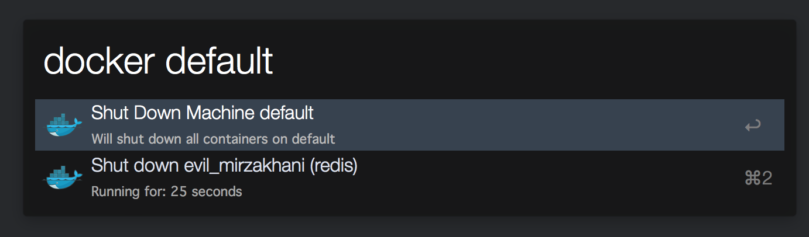

# Control Docker machines & containers with Alfred

[Download Workflow](https://github.com/keithamus/alfred-docker-wizard/releases/download/1.1.0/Docker.Wizard.alfredworkflow)

This workflow will list your Docker machines. Hitting enter on them will then
list your running Docker containers, for you to shut down.

## Usage

`docker`

List all Docker machines

`docker [query]`

Start filtering the list of Docker machines by `[query]`

`docker [full-machine-name]`

List all operations you can do with `[full-machine-name]`.

